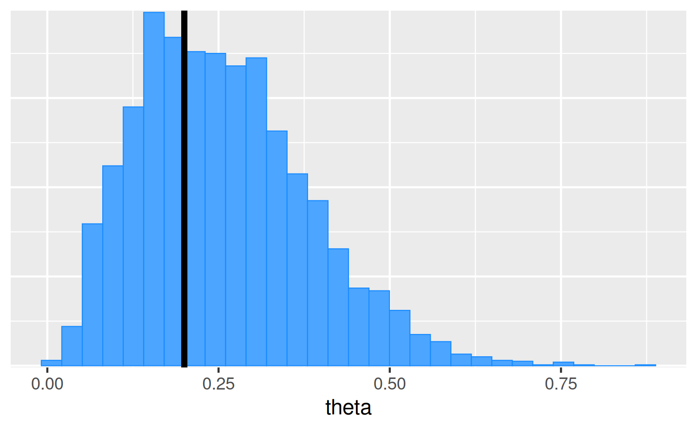
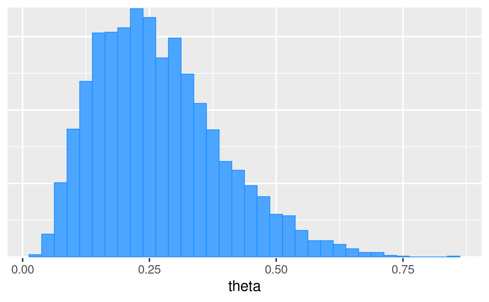
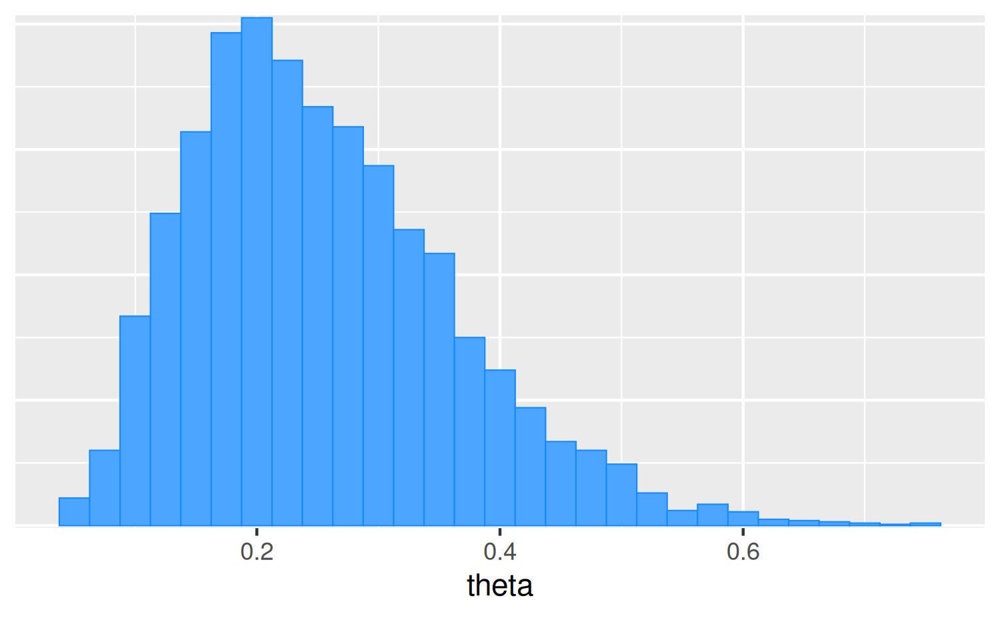
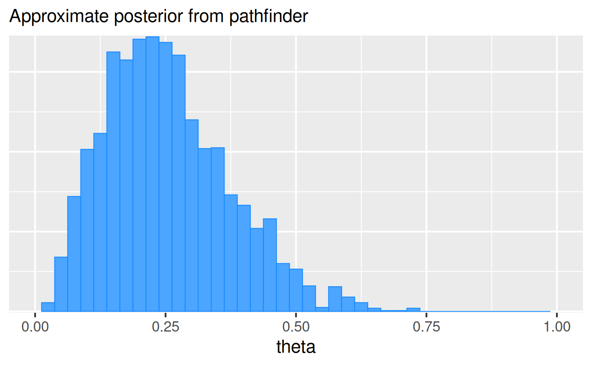
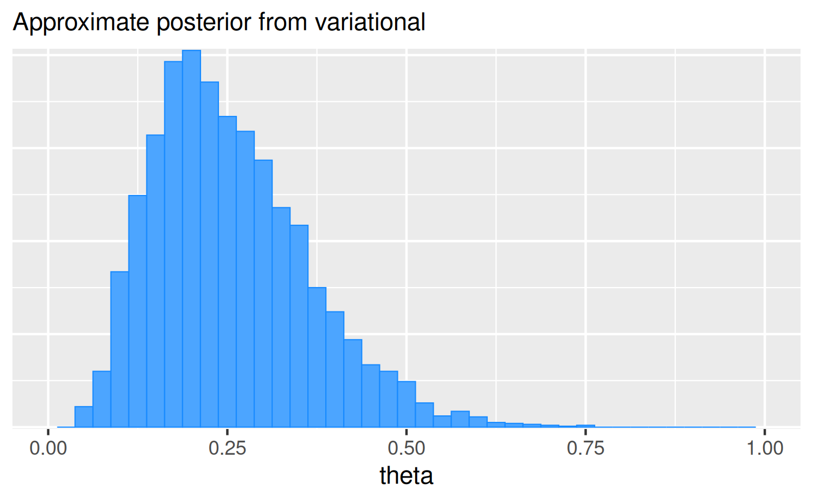
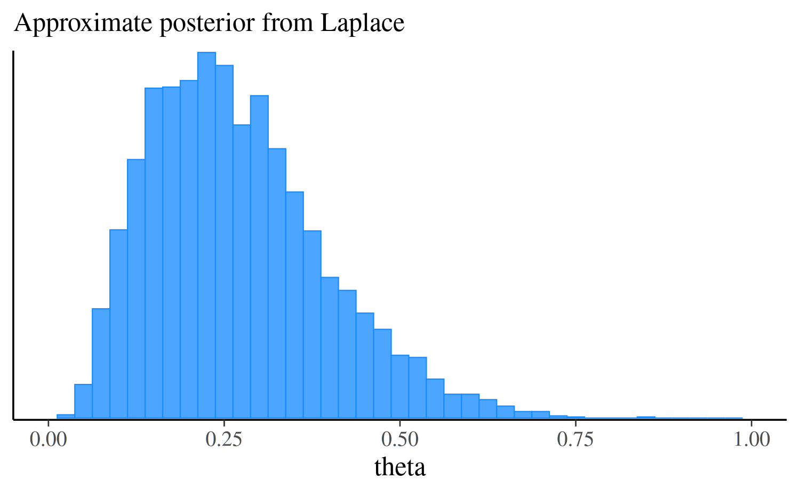
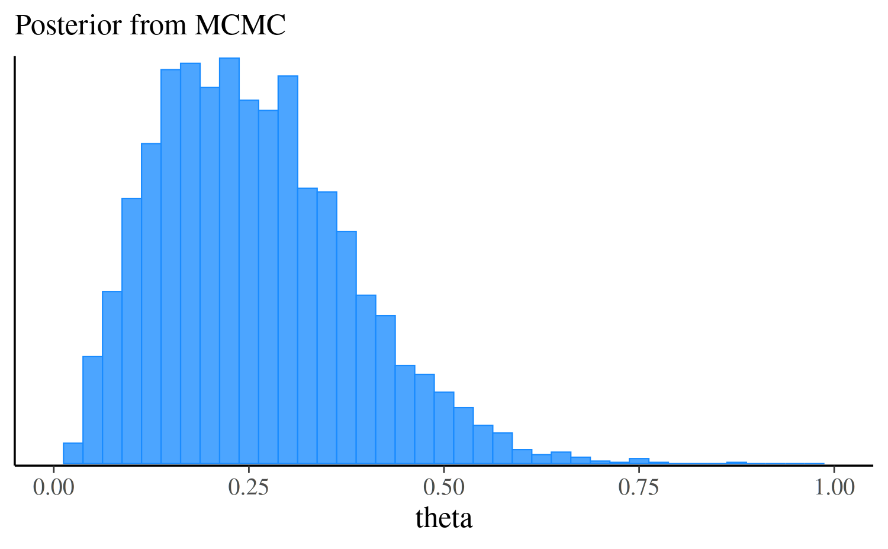

# Getting started with CmdStanR

## Introduction

CmdStanR (Command Stan R) is a lightweight interface to
[Stan](https://mc-stan.org/) for R users that provides an alternative to
the traditional [RStan](https://mc-stan.org/rstan/) interface. See the
[*Comparison with RStan*](#comparison-with-rstan) section later in this
vignette for more details on how the two interfaces differ.

Using CmdStanR requires installing the **cmdstanr** R package and also
CmdStan, the command line interface to Stan. First we install the R
package by running the following command in R.

``` r
# we recommend running this is a fresh R session or restarting your current session
install.packages("cmdstanr", repos = c('https://stan-dev.r-universe.dev', getOption("repos")))
```

We can now load the package like any other R package. We’ll also load
the **bayesplot** and **posterior** packages to use later in examples.

``` r
library(cmdstanr)
library(posterior)
library(bayesplot)
color_scheme_set("brightblue")
```

## Installing CmdStan

CmdStanR requires a working installation of
[CmdStan](https://mc-stan.org/users/interfaces/cmdstan.html), the shell
interface to Stan. If you don’t have CmdStan installed then CmdStanR can
install it for you, assuming you have a suitable C++ toolchain. The
requirements are described in the CmdStan Guide:

- <https://mc-stan.org/docs/cmdstan-guide/cmdstan-installation.html>

To double check that your toolchain is set up properly you can call the
[`check_cmdstan_toolchain()`](https://mc-stan.org/cmdstanr/dev/reference/install_cmdstan.md)
function:

``` r
check_cmdstan_toolchain()
```

    The C++ toolchain required for CmdStan is setup properly!

If your toolchain is configured correctly then CmdStan can be installed
by calling the
[`install_cmdstan()`](https://mc-stan.org/cmdstanr/reference/install_cmdstan.html)
function:

``` r
install_cmdstan(cores = 2)
```

Before CmdStanR can be used it needs to know where the CmdStan
installation is located. When the package is loaded it tries to help
automate this to avoid having to manually set the path every session:

1.  If the environment variable `"CMDSTAN"` exists at load time then its
    value will be automatically set as the default path to CmdStan for
    the R session. This is useful if your CmdStan installation is not
    located in the default directory that would have been used by
    [`install_cmdstan()`](https://mc-stan.org/cmdstanr/dev/reference/install_cmdstan.md)
    (see \#2).

2.  If no environment variable is found when loaded but any directory in
    the form `".cmdstan/cmdstan-[version]"`, for example
    `".cmdstan/cmdstan-2.23.0"`, exists in the user’s home directory
    (`Sys.getenv("HOME")`, *not* the current working directory) then the
    path to the CmdStan with the largest version number will be set as
    the path to CmdStan for the R session. This is the same as the
    default directory that
    [`install_cmdstan()`](https://mc-stan.org/cmdstanr/dev/reference/install_cmdstan.md)
    uses to install the latest version of CmdStan, so if that’s how you
    installed CmdStan you shouldn’t need to manually set the path to
    CmdStan when loading CmdStanR.

If neither of these applies (or you want to subsequently change the
path) you can use the
[`set_cmdstan_path()`](https://mc-stan.org/cmdstanr/dev/reference/set_cmdstan_path.md)
function:

``` r
set_cmdstan_path(PATH_TO_CMDSTAN)
```

To check the path to the CmdStan installation and the CmdStan version
number you can use
[`cmdstan_path()`](https://mc-stan.org/cmdstanr/dev/reference/set_cmdstan_path.md)
and
[`cmdstan_version()`](https://mc-stan.org/cmdstanr/dev/reference/set_cmdstan_path.md):

``` r
cmdstan_path()
```

    [1] "/home/runner/.cmdstan/cmdstan-2.37.0"

``` r
cmdstan_version()
```

    [1] "2.37.0"

## Compiling a model

The
[`cmdstan_model()`](https://mc-stan.org/cmdstanr/dev/reference/cmdstan_model.md)
function creates a new
[`CmdStanModel`](https://mc-stan.org/cmdstanr/reference/CmdStanModel.html)
object from a file containing a Stan program. Under the hood, CmdStan is
called to translate a Stan program to C++ and create a compiled
executable. Here we’ll use the example Stan program that comes with the
CmdStan installation:

``` r
file <- file.path(cmdstan_path(), "examples", "bernoulli", "bernoulli.stan")
mod <- cmdstan_model(file)
```

The object `mod` is an [R6](https://r6.r-lib.org/) reference object of
class
[`CmdStanModel`](https://mc-stan.org/cmdstanr/reference/CmdStanModel.html)
and behaves similarly to R’s reference class objects and those in object
oriented programming languages. Methods are accessed using the `$`
operator. This design choice allows for CmdStanR and
[CmdStanPy](https://github.com/stan-dev/cmdstanpy) to provide a similar
user experience and share many implementation details.

The Stan program can be printed using the `$print()` method:

``` r
mod$print()
```

    data {
      int<lower=0> N;
      array[N] int<lower=0, upper=1> y;
    }
    parameters {
      real<lower=0, upper=1> theta;
    }
    model {
      theta ~ beta(1, 1); // uniform prior on interval 0,1
      y ~ bernoulli(theta);
    }

The path to the compiled executable is returned by the `$exe_file()`
method:

``` r
mod$exe_file()
```

    [1] "/home/runner/.cmdstan/cmdstan-2.37.0/examples/bernoulli/bernoulli"

## Running MCMC

The
[`$sample()`](https://mc-stan.org/cmdstanr/reference/model-method-sample.html)
method for
[`CmdStanModel`](https://mc-stan.org/cmdstanr/reference/CmdStanModel.html)
objects runs Stan’s default MCMC algorithm. The `data` argument accepts
a named list of R objects (like for RStan) or a path to a data file
compatible with CmdStan (JSON or R dump).

``` r
# names correspond to the data block in the Stan program
data_list <- list(N = 10, y = c(0,1,0,0,0,0,0,0,0,1))

fit <- mod$sample(
  data = data_list,
  seed = 123,
  chains = 4,
  parallel_chains = 4,
  refresh = 500 # print update every 500 iters
)
```

    Running MCMC with 4 parallel chains...

    Chain 1 Iteration:    1 / 2000 [  0%]  (Warmup) 
    Chain 1 Iteration:  500 / 2000 [ 25%]  (Warmup) 
    Chain 1 Iteration: 1000 / 2000 [ 50%]  (Warmup) 
    Chain 1 Iteration: 1001 / 2000 [ 50%]  (Sampling) 
    Chain 1 Iteration: 1500 / 2000 [ 75%]  (Sampling) 
    Chain 1 Iteration: 2000 / 2000 [100%]  (Sampling) 
    Chain 2 Iteration:    1 / 2000 [  0%]  (Warmup) 
    Chain 2 Iteration:  500 / 2000 [ 25%]  (Warmup) 
    Chain 2 Iteration: 1000 / 2000 [ 50%]  (Warmup) 
    Chain 2 Iteration: 1001 / 2000 [ 50%]  (Sampling) 
    Chain 2 Iteration: 1500 / 2000 [ 75%]  (Sampling) 
    Chain 2 Iteration: 2000 / 2000 [100%]  (Sampling) 
    Chain 3 Iteration:    1 / 2000 [  0%]  (Warmup) 
    Chain 3 Iteration:  500 / 2000 [ 25%]  (Warmup) 
    Chain 3 Iteration: 1000 / 2000 [ 50%]  (Warmup) 
    Chain 3 Iteration: 1001 / 2000 [ 50%]  (Sampling) 
    Chain 3 Iteration: 1500 / 2000 [ 75%]  (Sampling) 
    Chain 3 Iteration: 2000 / 2000 [100%]  (Sampling) 
    Chain 4 Iteration:    1 / 2000 [  0%]  (Warmup) 
    Chain 4 Iteration:  500 / 2000 [ 25%]  (Warmup) 
    Chain 4 Iteration: 1000 / 2000 [ 50%]  (Warmup) 
    Chain 4 Iteration: 1001 / 2000 [ 50%]  (Sampling) 
    Chain 4 Iteration: 1500 / 2000 [ 75%]  (Sampling) 
    Chain 4 Iteration: 2000 / 2000 [100%]  (Sampling) 
    Chain 1 finished in 0.0 seconds.
    Chain 2 finished in 0.0 seconds.
    Chain 3 finished in 0.0 seconds.
    Chain 4 finished in 0.0 seconds.

    All 4 chains finished successfully.
    Mean chain execution time: 0.0 seconds.
    Total execution time: 0.3 seconds.

There are many more arguments that can be passed to the `$sample()`
method. For details follow this link to its separate documentation page:

- [`$sample()`](https://mc-stan.org/cmdstanr/reference/model-method-sample.html)

The `$sample()` method creates [R6](https://r6.r-lib.org/) `CmdStanMCMC`
objects, which have many associated methods. Below we will demonstrate
some of the most important methods. For a full list, follow this link to
the `CmdStanMCMC` documentation:

- [`CmdStanMCMC`](https://mc-stan.org/cmdstanr/reference/CmdStanMCMC.html)

### Posterior summary statistics

#### Summaries from the posterior package

The
[`$summary()`](https://mc-stan.org/cmdstanr/reference/fit-method-summary.html)
method calls
[`summarise_draws()`](https://mc-stan.org/posterior/reference/draws_summary.html)
from the **posterior** package. The first argument specifies the
variables to summarize and any arguments after that are passed on to
[`posterior::summarise_draws()`](https://mc-stan.org/posterior/reference/draws_summary.html)
to specify which summaries to compute, whether to use multiple cores,
etc.

``` r
fit$summary()
fit$summary(variables = c("theta", "lp__"), "mean", "sd")

# use a formula to summarize arbitrary functions, e.g. Pr(theta <= 0.5)
fit$summary("theta", pr_lt_half = ~ mean(. <= 0.5))

# summarise all variables with default and additional summary measures
fit$summary(
  variables = NULL,
  posterior::default_summary_measures(),
  extra_quantiles = ~posterior::quantile2(., probs = c(.0275, .975))
)
```

      variable  mean median   sd  mad     q5   q95 rhat ess_bulk ess_tail
    1     lp__ -7.30  -7.01 0.81 0.35 -8.821 -6.75    1     1834     2187
    2    theta  0.26   0.24 0.12 0.13  0.079  0.49    1     1165     1581

      variable  mean   sd
    1    theta  0.26 0.12
    2     lp__ -7.30 0.81

      variable pr_lt_half
    1    theta       0.96

      variable  mean median   sd  mad     q5   q95  q2.75 q97.5
    1     lp__ -7.30  -7.01 0.81 0.35 -8.821 -6.75 -9.333 -6.75
    2    theta  0.26   0.24 0.12 0.13  0.079  0.49  0.065  0.53

#### CmdStan’s stansummary utility

CmdStan itself provides a `stansummary` utility that can be called using
the `$cmdstan_summary()` method. This method will print summaries but
won’t return anything.

### Posterior draws

#### Extracting draws

The
[`$draws()`](https://mc-stan.org/cmdstanr/reference/fit-method-draws.html)
method can be used to extract the posterior draws in formats provided by
the [**posterior**](https://mc-stan.org/posterior/) package. Here we
demonstrate only the `draws_array` and `draws_df` formats, but the
**posterior** package supports other useful formats as well.

``` r
# default is a 3-D draws_array object from the posterior package
# iterations x chains x variables
draws_arr <- fit$draws() # or format="array"
str(draws_arr)
```

     'draws_array' num [1:1000, 1:4, 1:2] -7.01 -7.89 -7.41 -6.75 -6.91 ...
     - attr(*, "dimnames")=List of 3
      ..$ iteration: chr [1:1000] "1" "2" "3" "4" ...
      ..$ chain    : chr [1:4] "1" "2" "3" "4"
      ..$ variable : chr [1:2] "lp__" "theta"

``` r
# draws x variables data frame
draws_df <- fit$draws(format = "df")
str(draws_df)
```

    draws_df [4,000 × 5] (S3: draws_df/draws/tbl_df/tbl/data.frame)
     $ lp__      : num [1:4000] -7.01 -7.89 -7.41 -6.75 -6.91 ...
     $ theta     : num [1:4000] 0.168 0.461 0.409 0.249 0.185 ...
     $ .chain    : int [1:4000] 1 1 1 1 1 1 1 1 1 1 ...
     $ .iteration: int [1:4000] 1 2 3 4 5 6 7 8 9 10 ...
     $ .draw     : int [1:4000] 1 2 3 4 5 6 7 8 9 10 ...

``` r
print(draws_df)
```

    # A draws_df: 1000 iterations, 4 chains, and 2 variables
       lp__ theta
    1  -7.0  0.17
    2  -7.9  0.46
    3  -7.4  0.41
    4  -6.7  0.25
    5  -6.9  0.18
    6  -6.9  0.33
    7  -7.2  0.15
    8  -6.8  0.29
    9  -6.8  0.24
    10 -6.8  0.24
    # ... with 3990 more draws
    # ... hidden reserved variables {'.chain', '.iteration', '.draw'}

To convert an existing draws object to a different format use the
`posterior::as_draws_*()` functions.

``` r
# this should be identical to draws_df created via draws(format = "df")
draws_df_2 <- as_draws_df(draws_arr)
identical(draws_df, draws_df_2)
```

    [1] TRUE

In general, converting to a different draws format in this way will be
slower than just setting the appropriate format initially in the call to
the `$draws()` method, but in most cases the speed difference will be
minor.

The vignette [Working with
Posteriors](https://mc-stan.org/cmdstanr/articles/posterior.html) has
more details on posterior draws, including how to reproduce the
structured output RStan users are accustomed to getting from
`rstan::extract()`.

#### Plotting draws

Plotting posterior distributions is as easy as passing the object
returned by the `$draws()` method directly to plotting functions in our
[**bayesplot**](https://mc-stan.org/bayesplot/) package.

``` r
mcmc_hist(fit$draws("theta"))
```


### Sampler diagnostics

#### Extracting diagnostic values for each iteration and chain

The
[`$sampler_diagnostics()`](https://mc-stan.org/cmdstanr/reference/fit-method-sampler_diagnostics.html)
method extracts the values of the sampler parameters (`treedepth__`,
`divergent__`, etc.) in formats supported by the **posterior** package.
The default is as a 3-D array (iteration x chain x variable).

``` r
# this is a draws_array object from the posterior package
str(fit$sampler_diagnostics())
```

     'draws_array' num [1:1000, 1:4, 1:6] 2 1 2 2 2 1 2 1 2 1 ...
     - attr(*, "dimnames")=List of 3
      ..$ iteration: chr [1:1000] "1" "2" "3" "4" ...
      ..$ chain    : chr [1:4] "1" "2" "3" "4"
      ..$ variable : chr [1:6] "treedepth__" "divergent__" "energy__" "accept_stat__" ...

``` r
# this is a draws_df object from the posterior package
str(fit$sampler_diagnostics(format = "df"))
```

    draws_df [4,000 × 9] (S3: draws_df/draws/tbl_df/tbl/data.frame)
     $ treedepth__  : num [1:4000] 2 1 2 2 2 1 2 1 2 1 ...
     $ divergent__  : num [1:4000] 0 0 0 0 0 0 0 0 0 0 ...
     $ energy__     : num [1:4000] 8.95 8.77 7.87 7.64 6.93 ...
     $ accept_stat__: num [1:4000] 0.688 0.811 1 0.966 0.976 ...
     $ stepsize__   : num [1:4000] 0.905 0.905 0.905 0.905 0.905 ...
     $ n_leapfrog__ : num [1:4000] 3 3 3 3 3 3 3 3 3 3 ...
     $ .chain       : int [1:4000] 1 1 1 1 1 1 1 1 1 1 ...
     $ .iteration   : int [1:4000] 1 2 3 4 5 6 7 8 9 10 ...
     $ .draw        : int [1:4000] 1 2 3 4 5 6 7 8 9 10 ...

#### Sampler diagnostic warnings and summaries

The `$diagnostic_summary()` method will display any sampler diagnostic
warnings and return a summary of diagnostics for each chain.

``` r
fit$diagnostic_summary()
```

    $num_divergent
    [1] 0 0 0 0

    $num_max_treedepth
    [1] 0 0 0 0

    $ebfmi
    [1] 1.1 1.0 1.1 1.1

We see the number of divergences for each of the four chains, the number
of times the maximum treedepth was hit for each chain, and the E-BFMI
for each chain.

In this case there were no warnings, so in order to demonstrate the
warning messages we’ll use one of the CmdStanR example models that
suffers from divergences.

``` r
fit_with_warning <- cmdstanr_example("schools")
```

    Warning: 187 of 4000 (5.0%) transitions ended with a divergence.
    See https://mc-stan.org/misc/warnings for details.

    Warning: 1 of 4 chains had an E-BFMI less than 0.3.
    See https://mc-stan.org/misc/warnings for details.

After fitting there is a warning about divergences. We can also
regenerate this warning message later using `fit$diagnostic_summary()`.

``` r
diagnostics <- fit_with_warning$diagnostic_summary()
```

    Warning: 187 of 4000 (5.0%) transitions ended with a divergence.
    See https://mc-stan.org/misc/warnings for details.

    Warning: 1 of 4 chains had an E-BFMI less than 0.3.
    See https://mc-stan.org/misc/warnings for details.

``` r
print(diagnostics)
```

    $num_divergent
    [1] 60 10 48 69

    $num_max_treedepth
    [1] 0 0 0 0

    $ebfmi
    [1] 0.33 0.37 0.33 0.26

``` r
# number of divergences reported in warning is the sum of the per chain values
sum(diagnostics$num_divergent)
```

    [1] 187

#### CmdStan’s diagnose utility

CmdStan itself provides a `diagnose` utility that can be called using
the `$cmdstan_diagnose()` method. This method will print warnings but
won’t return anything.

## Running optimization and variational inference

CmdStanR also supports running Stan’s optimization algorithms and its
algorithms for variational approximation of full Bayesian inference.
These are run via the `$optimize()`, `$laplace()`, `$variational()`, and
`$pathfinder()` methods, which are called in a similar way to the
`$sample()` method demonstrated above.

### Optimization

We can find the (penalized) maximum likelihood estimate (MLE) using
[`$optimize()`](https://mc-stan.org/cmdstanr/reference/model-method-optimize.html).

``` r
fit_mle <- mod$optimize(data = data_list, seed = 123)
```

    Initial log joint probability = -16.144 
        Iter      log prob        ||dx||      ||grad||       alpha      alpha0  # evals  Notes  
           6      -5.00402   0.000246518   8.73164e-07           1           1        9    
    Optimization terminated normally:  
      Convergence detected: relative gradient magnitude is below tolerance 
    Finished in  0.1 seconds.

``` r
fit_mle$print() # includes lp__ (log prob calculated by Stan program)
```

     variable estimate
        lp__     -5.00
        theta     0.20

``` r
fit_mle$mle("theta")
```

    theta 
      0.2 

Here’s a plot comparing the penalized MLE to the posterior distribution
of `theta`.

``` r
mcmc_hist(fit$draws("theta")) +
  vline_at(fit_mle$mle("theta"), size = 1.5)
```

    Warning: 
[1m
[22mUsing `size` aesthetic for lines was deprecated in ggplot2 3.4.0.
    
[36mℹ
[39m Please use `linewidth` instead.
    
[36mℹ
[39m The deprecated feature was likely used in the 
[34mbayesplot
[39m package.
      Please report the issue at 
[3m
[34m<https://github.com/stan-dev/bayesplot/issues/>
[39m
[23m.
    
[90mThis warning is displayed once every 8 hours.
[39m
    
[90mCall `lifecycle::last_lifecycle_warnings()` to see where this warning was
[39m
    
[90mgenerated.
[39m



For optimization, by default the mode is calculated without the Jacobian
adjustment for constrained variables, which shifts the mode due to the
change of variables. To include the Jacobian adjustment and obtain a
maximum a posteriori (MAP) estimate set `jacobian=TRUE`. See the
[Maximum Likelihood
Estimation](https://mc-stan.org/docs/cmdstan-guide/maximum-likelihood-estimation.html)
section of the CmdStan User’s Guide for more details.

``` r
fit_map <- mod$optimize(
  data = data_list,
  jacobian = TRUE,
  seed = 123
)
```

    Initial log joint probability = -18.2733 
        Iter      log prob        ||dx||      ||grad||       alpha      alpha0  # evals  Notes  
           5      -6.74802   0.000708195   1.43227e-05           1           1        8    
    Optimization terminated normally:  
      Convergence detected: relative gradient magnitude is below tolerance 
    Finished in  0.1 seconds.

### Laplace Approximation

The
[`$laplace()`](https://mc-stan.org/cmdstanr/reference/model-method-laplace.html)
method produces a sample from a normal approximation centered at the
mode of a distribution in the unconstrained space. If the mode is a MAP
estimate, the samples provide an estimate of the mean and standard
deviation of the posterior distribution. If the mode is the MLE, the
sample provides an estimate of the standard error of the likelihood.
Whether the mode is the MAP or MLE depends on the value of the
`jacobian` argument when running optimization. See the [Laplace
Sampling](https://mc-stan.org/docs/cmdstan-guide/laplace-sampling.html)
chapter of the CmdStan User’s Guide for more details.

Here we pass in the `fit_map` object from above as the `mode` argument.
If `mode` is omitted then optimization will be run internally before
taking draws from the normal approximation.

``` r
fit_laplace <- mod$laplace(
    mode = fit_map,
    draws = 4000,
    data = data_list,
    seed = 123,
    refresh = 1000
  )
```

    Calculating Hessian 
    Calculating inverse of Cholesky factor 
    Generating draws 
    iteration: 0 
    iteration: 1000 
    iteration: 2000 
    iteration: 3000 
    Finished in  0.1 seconds.

``` r
fit_laplace$print("theta")
```

     variable mean median   sd  mad   q5  q95
        theta 0.27   0.25 0.12 0.12 0.10 0.51

``` r
mcmc_hist(fit_laplace$draws("theta"), binwidth = 0.025)
```



### Variational (ADVI)

We can run Stan’s experimental Automatic Differentiation Variational
Inference (ADVI) using the
[`$variational()`](https://mc-stan.org/cmdstanr/reference/model-method-variational.html)
method. For details on the ADVI algorithm see the [CmdStan User’s
Guide](https://mc-stan.org/docs/cmdstan-guide/variational-inference-algorithm-advi.html).

``` r
fit_vb <- mod$variational(
  data = data_list,
  seed = 123,
  draws = 4000
)
```

    ------------------------------------------------------------ 
    EXPERIMENTAL ALGORITHM: 
      This procedure has not been thoroughly tested and may be unstable 
      or buggy. The interface is subject to change. 
    ------------------------------------------------------------ 
    Gradient evaluation took 2e-06 seconds 
    1000 transitions using 10 leapfrog steps per transition would take 0.02 seconds. 
    Adjust your expectations accordingly! 
    Begin eta adaptation. 
    Iteration:   1 / 250 [  0%]  (Adaptation) 
    Iteration:  50 / 250 [ 20%]  (Adaptation) 
    Iteration: 100 / 250 [ 40%]  (Adaptation) 
    Iteration: 150 / 250 [ 60%]  (Adaptation) 
    Iteration: 200 / 250 [ 80%]  (Adaptation) 
    Success! Found best value [eta = 1] earlier than expected. 
    Begin stochastic gradient ascent. 
      iter             ELBO   delta_ELBO_mean   delta_ELBO_med   notes  
       100           -6.164             1.000            1.000 
       200           -6.225             0.505            1.000 
       300           -6.186             0.339            0.010   MEDIAN ELBO CONVERGED 
    Drawing a sample of size 4000 from the approximate posterior...  
    COMPLETED. 
    Finished in  0.1 seconds.

``` r
fit_vb$print("theta")
```

     variable mean median   sd  mad   q5  q95
        theta 0.26   0.24 0.11 0.11 0.11 0.46

``` r
mcmc_hist(fit_vb$draws("theta"), binwidth = 0.025)
```



### Variational (Pathfinder)

Stan version 2.33 introduced a new variational method called Pathfinder,
which is intended to be faster and more stable than ADVI. For details on
how Pathfinder works see the section in the [CmdStan User’s
Guide](https://mc-stan.org/docs/cmdstan-guide/pathfinder-intro.html#pathfinder-intro).
Pathfinder is run using the
[`$pathfinder()`](https://mc-stan.org/cmdstanr/reference/model-method-pathfinder.html)
method.

``` r
fit_pf <- mod$pathfinder(
  data = data_list,
  seed = 123,
  draws = 4000
)
```

    Path [1] :Initial log joint density = -18.273334 
    Path [1] : Iter      log prob        ||dx||      ||grad||     alpha      alpha0      # evals       ELBO    Best ELBO        Notes  
                  5      -6.748e+00      7.082e-04   1.432e-05    1.000e+00  1.000e+00       156 -6.216e+00 -6.145e+00                   
    Path [1] :Best Iter: [5] ELBO (-6.145070) evaluations: (156) 
    Path [2] :Initial log joint density = -19.192715 
    Path [2] : Iter      log prob        ||dx||      ||grad||     alpha      alpha0      # evals       ELBO    Best ELBO        Notes  
                  5      -6.748e+00      2.015e-04   2.228e-06    1.000e+00  1.000e+00       156 -6.170e+00 -6.223e+00                   
    Path [2] :Best Iter: [2] ELBO (-6.170358) evaluations: (156) 
    Path [3] :Initial log joint density = -6.774820 
    Path [3] : Iter      log prob        ||dx||      ||grad||     alpha      alpha0      # evals       ELBO    Best ELBO        Notes  
                  4      -6.748e+00      1.137e-04   2.596e-07    1.000e+00  1.000e+00       123 -6.243e+00 -6.178e+00                   
    Path [3] :Best Iter: [4] ELBO (-6.177909) evaluations: (123) 
    Path [4] :Initial log joint density = -7.949193 
    Path [4] : Iter      log prob        ||dx||      ||grad||     alpha      alpha0      # evals       ELBO    Best ELBO        Notes  
                  5      -6.748e+00      2.145e-04   1.301e-06    1.000e+00  1.000e+00       156 -6.235e+00 -6.197e+00                   
    Path [4] :Best Iter: [5] ELBO (-6.197118) evaluations: (156) 
    Finished in  0.1 seconds.

``` r
fit_pf$print("theta")
```

     variable mean median   sd  mad   q5  q95
        theta 0.25   0.24 0.12 0.12 0.08 0.47

Let’s extract the draws, make the same plot we made after running the
other algorithms, and compare them all. approximation, and compare them
all. In this simple example the distributions are quite similar, but
this will not always be the case for more challenging problems.

``` r
mcmc_hist(fit_pf$draws("theta"), binwidth = 0.025) +
  ggplot2::labs(subtitle = "Approximate posterior from pathfinder") +
  ggplot2::xlim(0, 1)
```



``` r
mcmc_hist(fit_vb$draws("theta"), binwidth = 0.025) +
  ggplot2::labs(subtitle = "Approximate posterior from variational") +
  ggplot2::xlim(0, 1)
```



``` r
mcmc_hist(fit_laplace$draws("theta"), binwidth = 0.025) +
  ggplot2::labs(subtitle = "Approximate posterior from Laplace") +
  ggplot2::xlim(0, 1)
```



``` r
mcmc_hist(fit$draws("theta"), binwidth = 0.025) +
  ggplot2::labs(subtitle = "Posterior from MCMC") +
  ggplot2::xlim(0, 1)
```



For more details on the `$optimize()`, `$laplace()`, `$variational()`,
and
[`pathfinder()`](https://mc-stan.org/cmdstanr/dev/reference/model-method-pathfinder.md)
methods, follow these links to their documentation pages.

- [`$optimize()`](https://mc-stan.org/cmdstanr/reference/model-method-optimize.html)
- [`$laplace()`](https://mc-stan.org/cmdstanr/reference/model-method-laplace.html)
- [`$variational()`](https://mc-stan.org/cmdstanr/reference/model-method-variational.html)
- [`$pathfinder()`](https://mc-stan.org/cmdstanr/reference/model-method-pathfinder.html)

## Saving fitted model objects

The
[`$save_object()`](http://mc-stan.org/cmdstanr/reference/fit-method-save_object.md)
method provided by CmdStanR is the most convenient way to save a fitted
model object to disk and ensure that all of the contents are available
when reading the object back into R.

``` r
fit$save_object(file = "fit.RDS")

# can be read back in using readRDS
fit2 <- readRDS("fit.RDS")
```

But if your model object is large, then
[`$save_object()`](http://mc-stan.org/cmdstanr/reference/fit-method-save_object.md)
could take a long time.
[`$save_object()`](http://mc-stan.org/cmdstanr/reference/fit-method-save_object.md)
reads the CmdStan results files into memory, stores them in the model
object, and saves the object with
[`saveRDS()`](https://rdrr.io/r/base/readRDS.html). To speed up the
process, you can emulate
[`$save_object()`](http://mc-stan.org/cmdstanr/reference/fit-method-save_object.md)
and replace `saveRDS` with the much faster `qsave()` function from the
[`qs`](https://github.com/traversc/qs) package.

``` r
# Load CmdStan output files into the fitted model object.
fit$draws() # Load posterior draws into the object.
try(fit$sampler_diagnostics(), silent = TRUE) # Load sampler diagnostics.
try(fit$init(), silent = TRUE) # Load user-defined initial values.
try(fit$profiles(), silent = TRUE) # Load profiling samples.

# Save the object to a file.
qs::qsave(x = fit, file = "fit.qs")

# Read the object.
fit2 <- qs::qread("fit.qs")
```

Storage is even faster if you discard results you do not need to save.
The following example saves only posterior draws and discards sampler
diagnostics, user-specified initial values, and profiling data.

``` r
# Load posterior draws into the fitted model object and omit other output.
fit$draws()

# Save the object to a file.
qs::qsave(x = fit, file = "fit.qs")

# Read the object.
fit2 <- qs::qread("fit.qs")
```

See the vignette [*How does CmdStanR
work?*](http://mc-stan.org/cmdstanr/articles/cmdstanr-internals.md) for
more information about the composition of CmdStanR objects.

## Comparison with RStan

### Different ways of interfacing with Stan’s C++

The RStan interface ([**rstan**](https://mc-stan.org/rstan/) package) is
an in-memory interface to Stan and relies on R packages like **Rcpp**
and **inline** to call C++ code from R. On the other hand, the CmdStanR
interface does not directly call any C++ code from R, instead relying on
the CmdStan interface behind the scenes for compilation, running
algorithms, and writing results to output files.

### Advantages of RStan

- Allows other developers to distribute R packages with *pre-compiled*
  Stan programs (like **rstanarm**) on CRAN. (Note: As of 2023, this can
  mostly be achieved with CmdStanR as well. See [Developing using
  CmdStanR](https://mc-stan.org/cmdstanr/articles/cmdstanr-internals.html#developing-using-cmdstanr).)

- Avoids use of R6 classes, which may result in more familiar syntax for
  many R users.

- CRAN binaries available for Mac and Windows.

### Advantages of CmdStanR

- Compatible with latest versions of Stan. Keeping up with Stan releases
  is complicated for RStan, often requiring non-trivial changes to the
  **rstan** package and new CRAN releases of both **rstan** and
  **StanHeaders**. With CmdStanR the latest improvements in Stan will be
  available from R immediately after updating CmdStan using
  [`cmdstanr::install_cmdstan()`](https://mc-stan.org/cmdstanr/dev/reference/install_cmdstan.md).

- Running Stan via external processes results in fewer unexpected
  crashes, especially in RStudio.

- Less memory overhead.

- More permissive license. RStan uses the GPL-3 license while the
  license for CmdStanR is BSD-3, which is a bit more permissive and is
  the same license used for CmdStan and the Stan C++ source code.

## Additional resources

There are additional vignettes available that discuss other aspects of
using CmdStanR. These can be found online at the CmdStanR website:

- <https://mc-stan.org/cmdstanr/articles/index.html>

To ask a question please post on the Stan forums:

- <https://discourse.mc-stan.org/>

To report a bug, suggest a feature (including additions to these
vignettes), or to start contributing to CmdStanR development (new
contributors welcome!) please open an issue on GitHub:

- <https://github.com/stan-dev/cmdstanr/issues>
