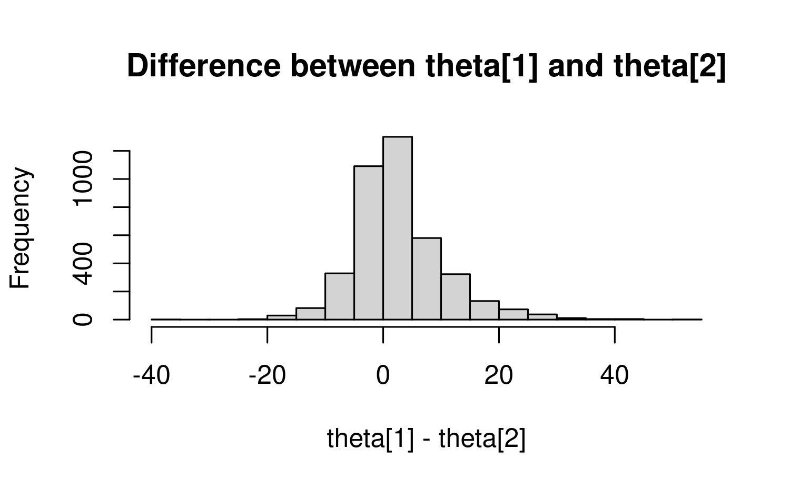

# Working with Posteriors

## Summary statistics

We can easily customize the summary statistics reported by `$summary()`
and `$print()`.

``` r

fit <- cmdstanr::cmdstanr_example("schools", method = "sample")
```

    Warning: 90 of 4000 (2.0%) transitions ended with a divergence.
    See https://mc-stan.org/misc/warnings for details.

``` r

fit$summary()
```

    
[38;5;246m# A tibble: 11 × 10
[39m
       variable   mean median    sd   mad      q5   q95  rhat ess_bulk ess_tail
       
[3m
[38;5;246m<chr>
[39m
[23m     
[3m
[38;5;246m<dbl>
[39m
[23m  
[3m
[38;5;246m<dbl>
[39m
[23m 
[3m
[38;5;246m<dbl>
[39m
[23m 
[3m
[38;5;246m<dbl>
[39m
[23m   
[3m
[38;5;246m<dbl>
[39m
[23m 
[3m
[38;5;246m<dbl>
[39m
[23m 
[3m
[38;5;246m<dbl>
[39m
[23m    
[3m
[38;5;246m<dbl>
[39m
[23m    
[3m
[38;5;246m<dbl>
[39m
[23m
    
[38;5;250m 1
[39m lp__     -
[31m58
[39m
[31m.
[39m
[31m3
[39m  -
[31m58
[39m
[31m.
[39m
[31m6
[39m   4.92  5.13 -
[31m66
[39m
[31m.
[39m
[31m1
[39m   -
[31m50
[39m
[31m.
[39m
[31m0
[39m  1.02     360.     316.
    
[38;5;250m 2
[39m mu         6.77   6.85  4.48  4.44  -
[31m0
[39m
[31m.
[39m
[31m582
[39m  13.9  1.00     537.     889.
    
[38;5;250m 3
[39m tau        5.33   4.56  3.39  3.21   1.25   11.9  1.02     359.     283.
    
[38;5;250m 4
[39m theta[1]   9.61   9.06  7.01  6.52  -
[31m0
[39m
[31m.
[39m
[31m924
[39m  21.5  1.00    
[4m1
[24m066.    
[4m1
[24m807.
    
[38;5;250m 5
[39m theta[2]   7.01   7.11  5.88  5.82  -
[31m2
[39m
[31m.
[39m
[31m87
[39m   16.4  1.00     834.    
[4m1
[24m891.
    
[38;5;250m 6
[39m theta[3]   5.76   6.06  6.91  6.53  -
[31m6
[39m
[31m.
[39m
[31m0
[39m
[31m7
[39m   16.1  1.00     877.    
[4m1
[24m844.
    
[38;5;250m 7
[39m theta[4]   6.66   6.72  5.97  5.80  -
[31m3
[39m
[31m.
[39m
[31m14
[39m   16.2  1.00     889.    
[4m2
[24m204.
    
[38;5;250m 8
[39m theta[5]   4.86   5.07  6.10  5.84  -
[31m5
[39m
[31m.
[39m
[31m63
[39m   14.2  1.00     695.    
[4m1
[24m278.
    
[38;5;250m 9
[39m theta[6]   5.77   6.08  6.14  5.93  -
[31m4
[39m
[31m.
[39m
[31m60
[39m   15.3  1.00     825.    
[4m1
[24m678.
    
[38;5;250m10
[39m theta[7]   9.34   9.04  6.22  5.91  -
[31m0
[39m
[31m.
[39m
[31m254
[39m  19.8  1.00    
[4m1
[24m020.    
[4m2
[24m068.
    
[38;5;250m11
[39m theta[8]   7.18   7.19  6.68  6.13  -
[31m3
[39m
[31m.
[39m
[31m77
[39m   17.7  1.00     950.    
[4m1
[24m718.

By default, all variables are summarized with the following functions:

``` r

posterior::default_summary_measures()
```

    [1] "mean"      "median"    "sd"        "mad"       "quantile2"

To change the variables summarized, use the `variables` argument:

``` r

fit$summary(variables = c("mu", "tau"))
```

    
[38;5;246m# A tibble: 2 × 10
[39m
      variable  mean median    sd   mad     q5   q95  rhat ess_bulk ess_tail
      
[3m
[38;5;246m<chr>
[39m
[23m    
[3m
[38;5;246m<dbl>
[39m
[23m  
[3m
[38;5;246m<dbl>
[39m
[23m 
[3m
[38;5;246m<dbl>
[39m
[23m 
[3m
[38;5;246m<dbl>
[39m
[23m  
[3m
[38;5;246m<dbl>
[39m
[23m 
[3m
[38;5;246m<dbl>
[39m
[23m 
[3m
[38;5;246m<dbl>
[39m
[23m    
[3m
[38;5;246m<dbl>
[39m
[23m    
[3m
[38;5;246m<dbl>
[39m
[23m
    
[38;5;250m1
[39m mu        6.77   6.85  4.48  4.44 -
[31m0
[39m
[31m.
[39m
[31m582
[39m  13.9  1.00     537.     889.
    
[38;5;250m2
[39m tau       5.33   4.56  3.39  3.21  1.25   11.9  1.02     359.     283.

We can also change which functions are used:

``` r

fit$summary(variables = c("mu", "tau"), mean, sd)
```

    
[38;5;246m# A tibble: 2 × 3
[39m
      variable  mean    sd
      
[3m
[38;5;246m<chr>
[39m
[23m    
[3m
[38;5;246m<dbl>
[39m
[23m 
[3m
[38;5;246m<dbl>
[39m
[23m
    
[38;5;250m1
[39m mu        6.77  4.48
    
[38;5;250m2
[39m tau       5.33  3.39

To summarize all variables with non-default functions, it is necessary
to explicitly set the `variables` argument, either to `NULL` or the full
vector of variable names.

``` r

fit$summary(variables = NULL, "mean", "median")
```

    
[38;5;246m# A tibble: 11 × 3
[39m
       variable   mean median
       
[3m
[38;5;246m<chr>
[39m
[23m     
[3m
[38;5;246m<dbl>
[39m
[23m  
[3m
[38;5;246m<dbl>
[39m
[23m
    
[38;5;250m 1
[39m lp__     -
[31m58
[39m
[31m.
[39m
[31m3
[39m  -
[31m58
[39m
[31m.
[39m
[31m6
[39m 
    
[38;5;250m 2
[39m mu         6.77   6.85
    
[38;5;250m 3
[39m tau        5.33   4.56
    
[38;5;250m 4
[39m theta[1]   9.61   9.06
    
[38;5;250m 5
[39m theta[2]   7.01   7.11
    
[38;5;250m 6
[39m theta[3]   5.76   6.06
    
[38;5;250m 7
[39m theta[4]   6.66   6.72
    
[38;5;250m 8
[39m theta[5]   4.86   5.07
    
[38;5;250m 9
[39m theta[6]   5.77   6.08
    
[38;5;250m10
[39m theta[7]   9.34   9.04
    
[38;5;250m11
[39m theta[8]   7.18   7.19

Summary functions can be specified by character string, function, or
using a formula (or anything else supported by
[`rlang::as_function()`](https://rlang.r-lib.org/reference/as_function.html)).
If these arguments are named, those names will be used in the tibble
output. If the summary results are named they will take precedence.

``` r

my_sd <- function(x) c(My_SD = sd(x))
fit$summary(
  c("mu", "tau"), 
  MEAN = mean, 
  "median",
  my_sd,
  ~quantile(.x, probs = c(0.1, 0.9)),
  Minimum = function(x) min(x)
)        
```

    
[38;5;246m# A tibble: 2 × 7
[39m
      variable  MEAN median My_SD `10%` `90%` Minimum
      
[3m
[38;5;246m<chr>
[39m
[23m    
[3m
[38;5;246m<dbl>
[39m
[23m  
[3m
[38;5;246m<dbl>
[39m
[23m 
[3m
[38;5;246m<dbl>
[39m
[23m 
[3m
[38;5;246m<dbl>
[39m
[23m 
[3m
[38;5;246m<dbl>
[39m
[23m   
[3m
[38;5;246m<dbl>
[39m
[23m
    
[38;5;250m1
[39m mu        6.77   6.85  4.48 0.887 12.5  -
[31m10
[39m
[31m.
[39m
[31m8
[39m  
    
[38;5;250m2
[39m tau       5.33   4.56  3.39 1.61   9.94   0.720

Arguments to all summary functions can also be specified with `.args`.

``` r

fit$summary(c("mu", "tau"), quantile, .args = list(probs = c(0.025, .05, .95, .975)))
```

    
[38;5;246m# A tibble: 2 × 5
[39m
      variable `2.5%`   `5%` `95%` `97.5%`
      
[3m
[38;5;246m<chr>
[39m
[23m     
[3m
[38;5;246m<dbl>
[39m
[23m  
[3m
[38;5;246m<dbl>
[39m
[23m 
[3m
[38;5;246m<dbl>
[39m
[23m   
[3m
[38;5;246m<dbl>
[39m
[23m
    
[38;5;250m1
[39m mu        -
[31m2
[39m
[31m.
[39m
[31m0
[39m
[31m4
[39m -
[31m0
[39m
[31m.
[39m
[31m582
[39m  13.9    15.3
    
[38;5;250m2
[39m tau        1.09  1.25   11.9    13.8

Each summary function is applied separately to each variable and
receives a matrix whose rows are saved iterations and whose columns are
chains.

``` r

fit$summary(variables = NULL, dim, colMeans)
```

    
[38;5;246m# A tibble: 11 × 7
[39m
       variable dim.1 dim.2    `1`    `2`    `3`    `4`
       
[3m
[38;5;246m<chr>
[39m
[23m    
[3m
[38;5;246m<dbl>
[39m
[23m 
[3m
[38;5;246m<dbl>
[39m
[23m  
[3m
[38;5;246m<dbl>
[39m
[23m  
[3m
[38;5;246m<dbl>
[39m
[23m  
[3m
[38;5;246m<dbl>
[39m
[23m  
[3m
[38;5;246m<dbl>
[39m
[23m
    
[38;5;250m 1
[39m lp__      
[4m1
[24m000     4 -
[31m57
[39m
[31m.
[39m
[31m9
[39m  -
[31m57
[39m
[31m.
[39m
[31m5
[39m  -
[31m58
[39m
[31m.
[39m
[31m3
[39m  -
[31m59
[39m
[31m.
[39m
[31m6
[39m 
    
[38;5;250m 2
[39m mu        
[4m1
[24m000     4   7.12   6.77   7.05   6.13
    
[38;5;250m 3
[39m tau       
[4m1
[24m000     4   5.16   4.80   5.25   6.11
    
[38;5;250m 4
[39m theta[1]  
[4m1
[24m000     4   9.97   9.05   9.98   9.47
    
[38;5;250m 5
[39m theta[2]  
[4m1
[24m000     4   7.50   6.89   7.27   6.39
    
[38;5;250m 6
[39m theta[3]  
[4m1
[24m000     4   6.22   6.01   6.00   4.81
    
[38;5;250m 7
[39m theta[4]  
[4m1
[24m000     4   7.18   6.62   6.78   6.06
    
[38;5;250m 8
[39m theta[5]  
[4m1
[24m000     4   5.01   5.18   5.17   4.07
    
[38;5;250m 9
[39m theta[6]  
[4m1
[24m000     4   6.21   5.76   6.05   5.04
    
[38;5;250m10
[39m theta[7]  
[4m1
[24m000     4   9.48   8.95   9.53   9.41
    
[38;5;250m11
[39m theta[8]  
[4m1
[24m000     4   7.65   7.09   7.56   6.40

For this reason users may have unexpected results if they use
[`stats::var()`](https://rdrr.io/r/stats/cor.html) directly, as it will
return a covariance matrix. An alternative is the
[`distributional::variance()`](https://pkg.mitchelloharawild.com/distributional/reference/variance.html)
function, which can also be accessed via
[`posterior::variance()`](https://pkg.mitchelloharawild.com/distributional/reference/variance.html).

``` r

fit$summary(c("mu", "tau"), posterior::variance, ~var(as.vector(.x)))
```

    
[38;5;246m# A tibble: 2 × 3
[39m
      variable `posterior::variance` `~var(as.vector(.x))`
      
[3m
[38;5;246m<chr>
[39m
[23m                    
[3m
[38;5;246m<dbl>
[39m
[23m                 
[3m
[38;5;246m<dbl>
[39m
[23m
    
[38;5;250m1
[39m mu                        20.0                  20.0
    
[38;5;250m2
[39m tau                       11.5                  11.5

Summary functions need not return numeric values when used with
`$summary()`. The `$print()` method requires numeric summary columns
because it rounds them to the requested number of digits.

``` r

strict_pos <- function(x) if (all(x > 0)) "yes" else "no"
fit$summary(variables = NULL, "Strictly Positive" = strict_pos)
```

    
[38;5;246m# A tibble: 11 × 2
[39m
       variable `Strictly Positive`
       
[3m
[38;5;246m<chr>
[39m
[23m    
[3m
[38;5;246m<chr>
[39m
[23m              
    
[38;5;250m 1
[39m lp__     no                 
    
[38;5;250m 2
[39m mu       no                 
    
[38;5;250m 3
[39m tau      yes                
    
[38;5;250m 4
[39m theta[1] no                 
    
[38;5;250m 5
[39m theta[2] no                 
    
[38;5;250m 6
[39m theta[3] no                 
    
[38;5;250m 7
[39m theta[4] no                 
    
[38;5;250m 8
[39m theta[5] no                 
    
[38;5;250m 9
[39m theta[6] no                 
    
[38;5;250m10
[39m theta[7] no                 
    
[38;5;250m11
[39m theta[8] no                 

``` r

# fit$print(variables = NULL, "Strictly Positive" = strict_pos)
```

For more information, see
[`posterior::summarise_draws()`](https://mc-stan.org/posterior/reference/draws_summary.html),
which is called by `$summary()`.

## Extracting posterior draws/samples

The
[`$draws()`](https://mc-stan.org/cmdstanr/reference/fit-method-draws.html)
method extracts draws in formats provided by the
[**posterior**](https://mc-stan.org/posterior/) package. The [*Getting
started with
CmdStanR*](https://mc-stan.org/cmdstanr/articles/cmdstanr.html#extracting-draws)
vignette introduces the most commonly used formats and how to convert
between them.

``` r

fit$draws("mu")
```

    # A draws_array: 1000 iterations, 4 chains, and 1 variables
    , , variable = mu

             chain
    iteration    1  2    3   4
            1  9.4 13  8.0 4.2
            2  8.3 13 -2.5 3.2
            3  7.2 13  2.0 3.2
            4 14.6 13  6.3 3.2
            5  8.0 13 10.5 3.2

    # ... with 995 more iterations

``` r

fit$draws("theta")
```

    # A draws_array: 1000 iterations, 4 chains, and 8 variables
    , , variable = theta[1]

             chain
    iteration    1  2    3   4
            1  4.5 14 17.0 6.0
            2  4.7 13 12.3 2.5
            3 28.4 13  6.4 2.5
            4 18.8 13 -1.6 2.5
            5  4.4 13  2.2 2.5

    , , variable = theta[2]

             chain
    iteration    1  2     3   4
            1  8.2 12 15.08 5.9
            2 10.1 13  4.29 5.0
            3 10.4 13 -0.86 5.0
            4 14.9 13  1.48 5.0
            5  3.9 13  9.04 5.0

    , , variable = theta[3]

             chain
    iteration    1  2     3   4
            1  1.6 16 13.17 4.4
            2  3.5 14 -4.18 3.2
            3 16.7 14 -4.22 3.2
            4 16.0 12 12.32 3.2
            5  2.0 12  0.82 3.2

    , , variable = theta[4]

             chain
    iteration    1  2     3   4
            1 16.6 11 -1.16 2.9
            2 13.1 13  5.97 2.5
            3  4.2 11  0.81 2.5
            4  2.1 14  9.74 2.5
            5 16.3 14  1.55 2.5

    # ... with 995 more iterations, and 4 more variables

``` r

fit$draws(c("mu", "theta[1]"), format = "df")
```

    # A draws_df: 1000 iterations, 4 chains, and 2 variables
         mu theta[1]
    1   9.4      4.5
    2   8.3      4.7
    3   7.2     28.4
    4  14.6     18.8
    5   8.0      4.4
    6   5.8     12.5
    7  10.9      4.2
    8   8.6     17.0
    9  11.7     17.7
    10 16.9     27.9
    # ... with 3990 more draws
    # ... hidden reserved variables {'.chain', '.iteration', '.draw'}

For MCMC fits, `inc_warmup = TRUE` includes warmup draws, but only if
`save_warmup = TRUE` was specified when fitting the model.

For more ways to manipulate draws, see the **posterior** package
[vignettes](https://mc-stan.org/posterior/articles/index.html) and
[documentation](https://mc-stan.org/posterior/reference/index.html).

### Structured draws similar to `rstan::extract()`

The **posterior** package provides two useful ways to work with
variables while preserving their original dimensions.

[`posterior::extract_list_of_variable_arrays()`](https://mc-stan.org/posterior/reference/extract_list_of_variable_arrays.html)
returns a named list containing one array per variable. Setting
`with_chains = FALSE` combines the chains, giving the same general
structure as the list returned by `rstan::extract()`:

``` r

draw_arrays <- posterior::extract_list_of_variable_arrays(
  fit$draws(),
  variables = c("mu", "theta"),
  with_chains = FALSE
)
str(draw_arrays)
```

    List of 2
     $ mu   : num [1:4000, 1] 9.45 8.3 7.18 14.58 8.05 ...
      ..- attr(*, "dimnames")=List of 2
      .. ..$ : chr [1:4000] "1" "2" "3" "4" ...
      .. ..$ : NULL
     $ theta: num [1:4000, 1:8] 4.47 4.66 28.35 18.82 4.38 ...
      ..- attr(*, "dimnames")=List of 2
      .. ..$ : chr [1:4000] "1" "2" "3" "4" ...
      .. ..$ : NULL

The first dimension of each array indexes draws, and any remaining
dimensions match the dimensions of the corresponding Stan variable.

Alternatively, the **posterior** package’s `rvar` format represents each
variable as a multidimensional random variable, with its posterior draws
handled behind the scenes:

``` r

draws_rvars <- posterior::as_draws_rvars(
  fit$draws(c("mu", "theta"))
)
theta_rvar <- draws_rvars$theta

# Compute the difference for every draw using natural vector indexing
# The posterior draws are handled automatically
theta_difference <- theta_rvar[1] - theta_rvar[2]
theta_difference
```

    rvar<1000,4>[1] 
[38;5;246mmean ± sd:
[39m
    [1] 2.6 ± 7.7 

``` r

hist(
  posterior::draws_of(theta_difference),
  main = "Difference between theta[1] and theta[2]",
  xlab = "theta[1] - theta[2]"
)
```



``` r

# Direct access to the underlying draws is also available
theta_array <- posterior::draws_of(theta_rvar)
dim(theta_array)
```

    [1] 4000    8

The object `theta_rvar` behaves like the vector declared in the Stan
program. `theta_array` provides direct access to its underlying draws,
with the first dimension indexing draws. See the [`rvar`
vignette](https://mc-stan.org/posterior/articles/rvar.html) for details.
