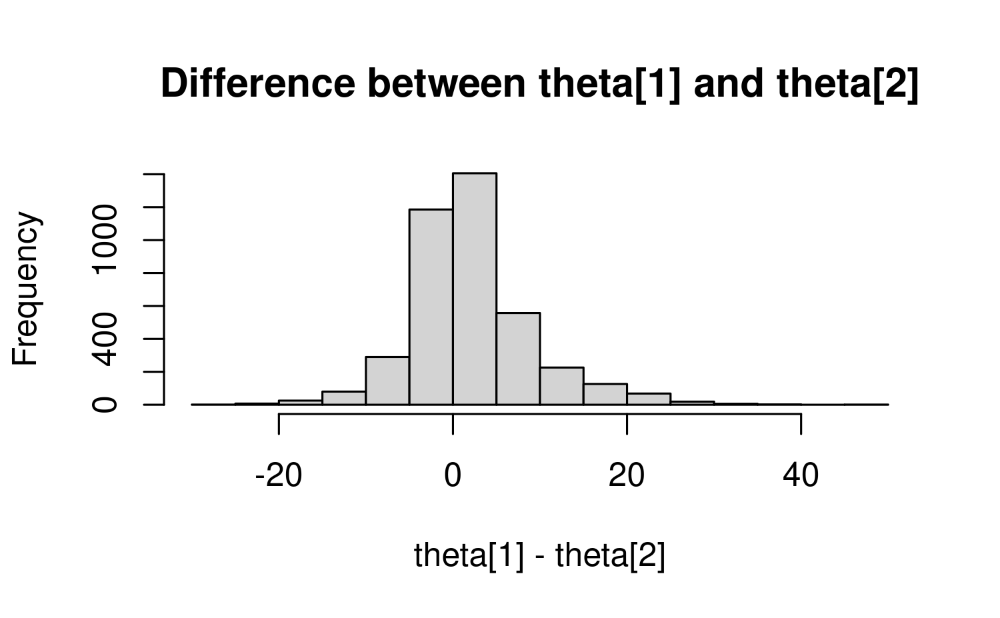
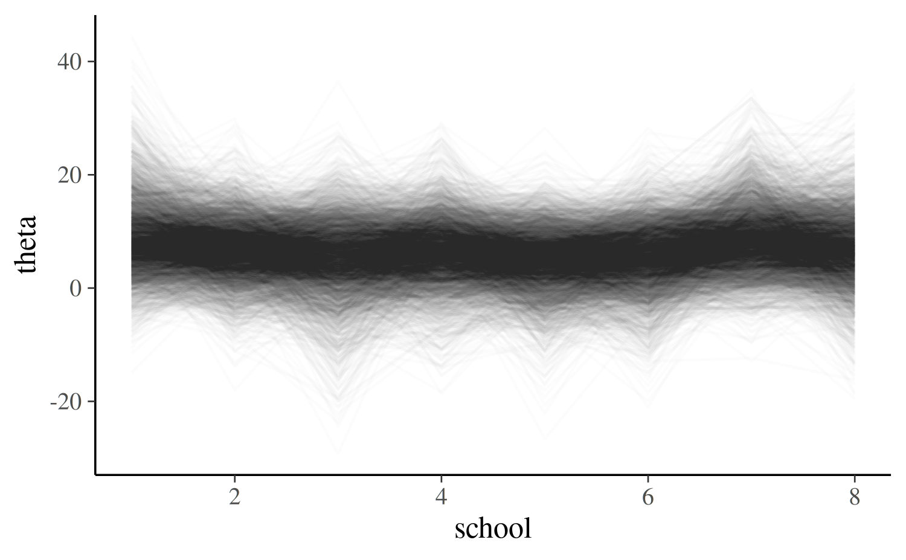

# Working with posteriors

``` r

library(cmdstanr)
library(posterior)
library(ggplot2)
theme_set(bayesplot::theme_default())
```

## Summary statistics

We can easily customize the summary statistics reported by `$summary()`
and `$print()`.

``` r

fit <- cmdstanr_example("schools_ncp", method = "sample")
```

    Warning: 1 of 4000 (0.0%) transitions ended with a divergence.
    See https://mc-stan.org/misc/warnings for details.

``` r

fit$summary()
```

    # A tibble: 19 × 10
       variable     mean   median    sd   mad      q5    q95  rhat ess_bulk ess_tail
       <chr>       <dbl>    <dbl> <dbl> <dbl>   <dbl>  <dbl> <dbl>    <dbl>    <dbl>
     1 lp__     -46.9    -46.6    2.44  2.31  -51.3   -43.5   1.00    1717.    2154.
     2 mu         6.46     6.52   4.23  4.25   -0.476  13.3   1.00    3196.    2474.
     3 tau        4.76     3.94   3.69  3.50    0.398  11.6   1.00    1996.    1918.
     4 theta_r…   0.354    0.342  0.953 0.968  -1.21    1.89  1.00    3840.    2857.
     5 theta_r…   0.0524   0.0590 0.905 0.911  -1.42    1.55  1.00    3948.    3165.
     6 theta_r…  -0.163   -0.172  0.952 0.925  -1.73    1.41  1.00    3660.    2914.
     7 theta_r…   0.0156   0.0193 0.921 0.896  -1.53    1.52  1.00    4162.    2704.
     8 theta_r…  -0.269   -0.269  0.896 0.859  -1.74    1.21  1.00    4049.    3019.
     9 theta_r…  -0.167   -0.186  0.919 0.900  -1.66    1.38  1.00    4202.    2979.
    10 theta_r…   0.351    0.371  0.972 0.946  -1.25    1.93  1.00    3552.    2618.
    11 theta_r…   0.0862   0.0813 0.946 0.947  -1.49    1.64  1.00    4403.    3067.
    12 theta[1]   8.85     8.11   6.67  5.83   -0.687  20.5   1.00    3546.    3147.
    13 theta[2]   6.82     6.70   5.41  5.13   -1.91   15.8   1.00    4684.    3650.
    14 theta[3]   5.34     5.59   6.51  5.77   -5.92   15.1   1.00    3912.    2735.
    15 theta[4]   6.60     6.42   5.56  5.16   -2.15   15.6   1.00    4355.    3376.
    16 theta[5]   4.79     5.07   5.50  5.17   -4.76   13.3   1.00    3918.    3061.
    17 theta[6]   5.50     5.70   5.87  5.14   -4.44   14.8   1.00    4147.    3146.
    18 theta[7]   8.74     8.25   6.18  5.67   -0.425  19.8   1.00    3986.    3189.
    19 theta[8]   6.99     6.88   6.44  5.58   -3.10   17.5   1.00    3649.    2981.

By default, all variables are summarized with the following functions:

``` r

posterior::default_summary_measures()
```

    [1] "mean"      "median"    "sd"        "mad"       "quantile2"

To change the variables summarized, use the `variables` argument:

``` r

fit$summary(variables = c("mu", "tau", "theta"))
```

    # A tibble: 10 × 10
       variable  mean median    sd   mad     q5   q95  rhat ess_bulk ess_tail
       <chr>    <dbl>  <dbl> <dbl> <dbl>  <dbl> <dbl> <dbl>    <dbl>    <dbl>
     1 mu        6.46   6.52  4.23  4.25 -0.476  13.3  1.00    3196.    2474.
     2 tau       4.76   3.94  3.69  3.50  0.398  11.6  1.00    1996.    1918.
     3 theta[1]  8.85   8.11  6.67  5.83 -0.687  20.5  1.00    3546.    3147.
     4 theta[2]  6.82   6.70  5.41  5.13 -1.91   15.8  1.00    4684.    3650.
     5 theta[3]  5.34   5.59  6.51  5.77 -5.92   15.1  1.00    3912.    2735.
     6 theta[4]  6.60   6.42  5.56  5.16 -2.15   15.6  1.00    4355.    3376.
     7 theta[5]  4.79   5.07  5.50  5.17 -4.76   13.3  1.00    3918.    3061.
     8 theta[6]  5.50   5.70  5.87  5.14 -4.44   14.8  1.00    4147.    3146.
     9 theta[7]  8.74   8.25  6.18  5.67 -0.425  19.8  1.00    3986.    3189.
    10 theta[8]  6.99   6.88  6.44  5.58 -3.10   17.5  1.00    3649.    2981.

We can also change which functions are used:

``` r

fit$summary(variables = c("mu", "tau"), mean, sd)
```

    # A tibble: 2 × 3
      variable  mean    sd
      <chr>    <dbl> <dbl>
    1 mu        6.46  4.23
    2 tau       4.76  3.69

To summarize all variables with non-default functions, it is necessary
to explicitly set the `variables` argument, either to `NULL` or the full
vector of variable names.

``` r

fit$summary(variables = NULL, "mean", "median")
```

    # A tibble: 19 × 3
       variable         mean   median
       <chr>           <dbl>    <dbl>
     1 lp__         -46.9    -46.6   
     2 mu             6.46     6.52  
     3 tau            4.76     3.94  
     4 theta_raw[1]   0.354    0.342 
     5 theta_raw[2]   0.0524   0.0590
     6 theta_raw[3]  -0.163   -0.172 
     7 theta_raw[4]   0.0156   0.0193
     8 theta_raw[5]  -0.269   -0.269 
     9 theta_raw[6]  -0.167   -0.186 
    10 theta_raw[7]   0.351    0.371 
    11 theta_raw[8]   0.0862   0.0813
    12 theta[1]       8.85     8.11  
    13 theta[2]       6.82     6.70  
    14 theta[3]       5.34     5.59  
    15 theta[4]       6.60     6.42  
    16 theta[5]       4.79     5.07  
    17 theta[6]       5.50     5.70  
    18 theta[7]       8.74     8.25  
    19 theta[8]       6.99     6.88  

Summary functions can be specified by character string, function, or
using a formula (or anything else supported by
[`rlang::as_function()`](https://rlang.r-lib.org/reference/as_function.html)).
If these arguments are named, those names will be used in the tibble
output. If the summary results are named they will take precedence.

``` r

my_sd <- function(x) c(My_SD = sd(x))
fit$summary(
  c("mu", "tau"), 
  MEAN = mean, 
  "median",
  my_sd,
  ~quantile(.x, probs = c(0.1, 0.9)),
  Minimum = function(x) min(x)
)        
```

    # A tibble: 2 × 7
      variable  MEAN median My_SD `10%` `90%`   Minimum
      <chr>    <dbl>  <dbl> <dbl> <dbl> <dbl>     <dbl>
    1 mu        6.46   6.52  4.23 1.06  11.9  -9.30    
    2 tau       4.76   3.94  3.69 0.721  9.77  0.000211

Arguments to all summary functions can also be specified with `.args`.

``` r

fit$summary(c("mu", "tau"), quantile, .args = list(probs = c(0.025, .05, .95, .975)))
```

    # A tibble: 2 × 5
      variable `2.5%`   `5%` `95%` `97.5%`
      <chr>     <dbl>  <dbl> <dbl>   <dbl>
    1 mu       -1.82  -0.476  13.3    14.7
    2 tau       0.192  0.398  11.6    13.8

Each summary function is applied separately to each variable and
receives a matrix whose rows are saved iterations and whose columns are
chains.

``` r

fit$summary(variables = "theta", dim, colMeans)
```

    # A tibble: 8 × 7
      variable dim.1 dim.2   `1`   `2`   `3`   `4`
      <chr>    <dbl> <dbl> <dbl> <dbl> <dbl> <dbl>
    1 theta[1]  1000     4  9.20  9.08  8.69  8.42
    2 theta[2]  1000     4  7.03  6.92  6.48  6.83
    3 theta[3]  1000     4  5.39  5.20  5.36  5.40
    4 theta[4]  1000     4  6.87  6.43  6.24  6.85
    5 theta[5]  1000     4  4.89  4.81  4.62  4.83
    6 theta[6]  1000     4  5.62  5.71  5.41  5.25
    7 theta[7]  1000     4  9.08  8.78  8.52  8.58
    8 theta[8]  1000     4  7.05  6.91  7.02  6.98

For this reason users may have unexpected results if they use
[`stats::var()`](https://rdrr.io/r/stats/cor.html) directly, as it will
return a covariance matrix. An alternative is the
[`distributional::variance()`](https://pkg.mitchelloharawild.com/distributional/reference/variance.html)
function, which can also be accessed via
[`posterior::variance()`](https://pkg.mitchelloharawild.com/distributional/reference/variance.html).

``` r

fit$summary(c("mu", "tau"), posterior::variance, ~var(as.vector(.x)))
```

    # A tibble: 2 × 3
      variable `posterior::variance` `~var(as.vector(.x))`
      <chr>                    <dbl>                 <dbl>
    1 mu                        17.9                  17.9
    2 tau                       13.6                  13.6

Summary functions need not return numeric values when used with
`$summary()`. The `$print()` method requires numeric summary columns
because it rounds them to the requested number of digits.

``` r

strict_pos <- function(x) if (all(x > 0)) "yes" else "no"
fit$summary(variables = c("mu", "tau", "theta"), "Strictly Positive" = strict_pos)
```

    # A tibble: 10 × 2
       variable `Strictly Positive`
       <chr>    <chr>              
     1 mu       no                 
     2 tau      yes                
     3 theta[1] no                 
     4 theta[2] no                 
     5 theta[3] no                 
     6 theta[4] no                 
     7 theta[5] no                 
     8 theta[6] no                 
     9 theta[7] no                 
    10 theta[8] no                 

``` r

# fit$print(variables = NULL, "Strictly Positive" = strict_pos)
```

For more information, see
[`posterior::summarise_draws()`](https://mc-stan.org/posterior/reference/draws_summary.html),
which is called internally by `$summary()`.

## Extracting posterior draws/samples

The
[`$draws()`](https://mc-stan.org/cmdstanr/reference/fit-method-draws.html)
method extracts draws in formats provided by the
[**posterior**](https://mc-stan.org/posterior/) package. The [*Getting
started with
CmdStanR*](https://mc-stan.org/cmdstanr/articles/cmdstanr.html#extracting-draws)
vignette introduces the most commonly used formats and how to convert
between them.

``` r

fit$draws("mu")
```

    # A draws_array: 1000 iterations, 4 chains, and 1 variables
    , , variable = mu

             chain
    iteration    1      2    3     4
            1  6.1  4.342  3.0  3.69
            2 13.1  0.029 14.5  0.31
            3 -5.0 -4.071  1.9 10.67
            4 10.6 -3.879 12.8  2.15
            5 10.2  6.221  4.6  1.21

    # ... with 995 more iterations

``` r

fit$draws("theta")
```

    # A draws_array: 1000 iterations, 4 chains, and 8 variables
    , , variable = theta[1]

             chain
    iteration    1    2     3     4
            1  4.5  8.9  0.15  0.33
            2 12.3  7.7 22.04 -2.54
            3 -2.3 10.9 -1.39  9.25
            4 12.9 14.2 13.39  3.97
            5 11.0  6.2  9.05  2.13

    , , variable = theta[2]

             chain
    iteration    1    2    3     4
            1 10.0  4.0  4.1 -1.54
            2 12.6 11.2 10.3  0.17
            3 -3.3 -4.1  4.0 17.05
            4 10.3 -5.3 12.6  1.77
            5  6.5  9.3 -8.9 -0.35

    , , variable = theta[3]

             chain
    iteration    1    2    3     4
            1  6.3  2.7  8.3  8.87
            2 13.5  5.7  5.2 -1.06
            3 -6.4 -6.9  2.4 11.83
            4 11.4 -7.4 14.2  0.98
            5  7.4  6.2 -5.3 -3.45

    , , variable = theta[4]

             chain
    iteration    1      2     3     4
            1  4.8 -0.046 -2.23 -2.42
            2 12.5 11.259 18.44 -2.90
            3 -2.8 -0.327 -0.59 12.44
            4  7.9  7.832 13.33  2.30
            5 13.3  5.988  7.73 -0.84

    # ... with 995 more iterations, and 4 more variables

``` r

fit$draws(c("mu", "theta[1]"), format = "df")
```

    # A draws_df: 1000 iterations, 4 chains, and 2 variables
         mu theta[1]
    1   6.1      4.5
    2  13.1     12.3
    3  -5.0     -2.3
    4  10.6     12.9
    5  10.2     11.0
    6   4.8      4.9
    7   9.5     12.0
    8  13.1     16.7
    9  12.6     15.6
    10 13.4     21.2
    # ... with 3990 more draws
    # ... hidden reserved variables {'.chain', '.iteration', '.draw'}

For MCMC fits, `inc_warmup = TRUE` includes warmup draws, but only if
`save_warmup = TRUE` was specified when fitting the model.

For more ways to manipulate draws, see the **posterior** package
[vignettes](https://mc-stan.org/posterior/articles/index.html) and
[documentation](https://mc-stan.org/posterior/reference/index.html).

### Structured draws similar to `rstan::extract()`

The **posterior** package provides two useful ways to work with
variables while preserving their original dimensions.

[`posterior::extract_list_of_variable_arrays()`](https://mc-stan.org/posterior/reference/extract_list_of_variable_arrays.html)
returns a named list containing one array per variable. Setting
`with_chains = FALSE` combines the chains, giving the same general
structure as the list returned by `rstan::extract()`:

``` r

draw_arrays <- extract_list_of_variable_arrays(
  fit$draws(),
  variables = c("mu", "theta"),
  with_chains = FALSE
)
str(draw_arrays)
```

    List of 2
     $ mu   : num [1:4000, 1] 6.12 13.12 -4.96 10.64 10.17 ...
      ..- attr(*, "dimnames")=List of 2
      .. ..$ : chr [1:4000] "1" "2" "3" "4" ...
      .. ..$ : NULL
     $ theta: num [1:4000, 1:8] 4.52 12.27 -2.34 12.92 10.98 ...
      ..- attr(*, "dimnames")=List of 2
      .. ..$ : chr [1:4000] "1" "2" "3" "4" ...
      .. ..$ : NULL

``` r

dim(draw_arrays$theta)
```

    [1] 4000    8

The first dimension of each array indexes draws, and any remaining
dimensions match the dimensions of the corresponding Stan variable.

Alternatively, the **posterior** package’s `rvar` format represents each
variable as a multidimensional random variable, with its posterior draws
handled behind the scenes:

``` r

draws_rvars <- as_draws_rvars(
  fit$draws(c("mu", "theta"))
)
theta_rvar <- draws_rvars$theta

# Compute the difference for every draw using natural vector indexing
# The posterior draws are handled automatically
theta_difference <- theta_rvar[1] - theta_rvar[2]
theta_difference
```

    rvar<1000,4>[1] mean ± sd:
    [1] 2 ± 7.1 

``` r

hist(
  draws_of(theta_difference),
  main = "Difference between theta[1] and theta[2]",
  xlab = "theta[1] - theta[2]"
)
```



``` r

# Direct access to the underlying draws is also available with posterior::draws_of
theta_array <- draws_of(theta_rvar)
dim(theta_array)
```

    [1] 4000    8

The object `theta_rvar` behaves like the vector declared in the Stan
program. `theta_array` provides direct access to its underlying draws,
with the first dimension indexing draws. See the [`rvar`
vignette](https://mc-stan.org/posterior/articles/rvar.html) for details.

### Plotting the draws of a vector

Because `theta_array` has draws in the first dimension and the vector
index (the eight schools) in the second, we can reshape it into a long
data frame and overlay the individual draws.

``` r

theta_plot <- draw_arrays$theta

theta_df <- data.frame(
  .draw = rep(seq_len(nrow(theta_plot)), times = ncol(theta_plot)),
  school = rep(seq_len(ncol(theta_plot)), each = nrow(theta_plot)),
  theta = c(theta_plot)
)

ggplot(theta_df, aes(school, theta, group = .draw)) +
  geom_line(alpha = 0.01)
```



The reshaping above uses only base R. Tidyverse users can produce the
same plot directly from the draws data frame (`format = "df"`) with
[`tidyr::pivot_longer()`](https://tidyr.tidyverse.org/reference/pivot_longer.html),
extracting the vector index from variable names like `theta[1]`:

``` r

fit$draws("theta", format = "df") |>
  tidyr::pivot_longer(
    cols = dplyr::starts_with("theta"),
    names_to = "school",
    names_transform = readr::parse_number,
    values_to = "theta"
  ) |>
  ggplot(aes(school, theta, group = .draw)) +
  geom_line(alpha = 0.01)
```

Here `school` is simply the index into the `theta` vector. In many
models the vector index corresponds to a meaningful covariate, for
example the time points of a time series. In that case you can replace
`school` with the associated covariate values to plot each draw as a
function of that covariate.
